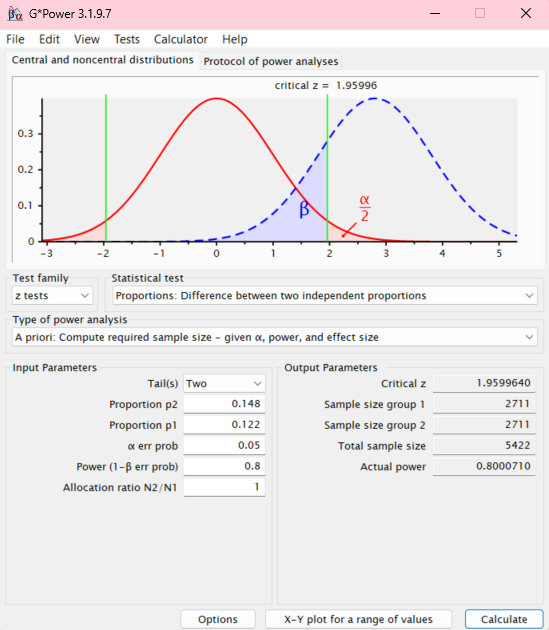

# **Teste A/B para comparar duas versões de um site de e-commerce**

### Resumo

Esse projeto consistiu no design e realização de um experimento com objetivo de verificar se a alteração de layout em uma página de e-commerce poderia resultar em um aumento de conversão dos usuários.

Para tanto, estabeleceu-se a meta de aumento desejada na taxa de conversão e determinou-se o tamanho da amostra necessária para comprovação do efeito esperado. Após a coleta de dados, as taxas de conversão dos grupos de controle e de tratamento foram comparadas por meio de um teste Z para proporção de duas amostras independentes.

Os resultados comprovaram que a mudança no design da página do site alcança uma maior taxa de conversão.

O passo a passo adotado no projeto e os detalhes da experimentação podem ser vistos neste [notebook Python](notebooks/teste_ab.ipynb).

Leia mais sobre o projeto abaixo.

### Índice

- [1. Contexto](https://github.com/luisamuzzi/teste_ab_conversao_site?tab=readme-ov-file#1-contexto)
- [2. Premissas assumidas para a análise](https://github.com/luisamuzzi/teste_ab_conversao_site?tab=readme-ov-file#2-premissas-assumidas-para-a-an%C3%A1lise)
- [3. Ferramentas utilizadas](https://github.com/luisamuzzi/teste_ab_conversao_site?tab=readme-ov-file#3-ferramentas-utilizadas)
- [4. Estratégia de solução](https://github.com/luisamuzzi/teste_ab_conversao_site?tab=readme-ov-file#4-estrat%C3%A9gia-de-solu%C3%A7%C3%A3o)
- [5. O produto final do projeto](https://github.com/luisamuzzi/teste_ab_conversao_site?tab=readme-ov-file#5-o-produto-final-do-projeto)
- [6. Principais insights de dados](https://github.com/luisamuzzi/teste_ab_conversao_site?tab=readme-ov-file#6-principais-insights-de-dados)
- [7. Conclusão](https://github.com/luisamuzzi/teste_ab_conversao_site?tab=readme-ov-file#7-conclus%C3%A3o)
- [8. Próximos passos](https://github.com/luisamuzzi/teste_ab_conversao_site?tab=readme-ov-file#8-pr%C3%B3ximos-passos)
- [9. Referências](https://github.com/luisamuzzi/teste_ab_conversao_site?tab=readme-ov-file#9-refer%C3%AAncias)

### 1. Contexto

Uma empresa de e-commerce quer testar se um novo design em seu site aumenta o número de conversões (clientes que entram na página e compram) em 21%. Após verificarmos que o aumento de conversão é de fato possível via mudança no design, decidimos realizar um experimento (há espaço no mercado para aumento, e fatores relacionados à qualidade do site, como tempo de carregamento, não estão influenciando uma baixa conversão).

Portanto, esse projeto compara duas versões de página de site de e-commerce em relação à conversão por meio de um teste A/B.

Durante o período de teste, um determinado número de usuários foi direcionado para a versão atual da página (grupo de controle) e outro grupo viu a nova versão (grupo de tratamento). Ao final do experimento, os resultados dos grupos foram comparados para determinar se a diferença de conversão entre eles era estatísticamente significativa.

### 2. Premissas assumidas para a análise

- A conversão atual não está sendo influenciada por problemas estruturais do site (lentidão de carregamento, problemas ao carregar a página, etc).
- A meta de aumento da taxa de conversão foi escolhida com base em valores da literatura e estudos, sendo factível de ser atingida.

### 3. Ferramentas utilizadas

Para realização do experimento, foram utilizadas as seguintes bibliotecas Python:

- `pandas`
- `statsmodels.stats.proportion`

### 4. Estratégia de solução

Para realização do experimento, foram realizadas quatro etapas, descritas a seguir.

- **Etapa 1: Escolha da métrica de sucesso e medida do seu valor atual**

*Definição das hipóteses do teste:*

Definimos as hipóteses do nosso teste da seguinte forma:

Hₒ: p = pₒ

Hₐ: p ≠ pₒ

Sendo:

p -> Taxa de conversão do site novo

pₒ -> Taxa de conversão do site antigo

Nosso nível de confiança será de 95% (alpha = 5%).

O teste é bicaudal porque não sabemos se o desempenho da nova página será melhor, pior ou igual à página atual. 
Não há problema em realizar o teste bicaudal porque se o resultado for significativo e o valor de p for maior que pₒ na amostra, também o será na população.

*Cálculo da medida atual da métrica de sucesso:*

A métrica de sucesso a ser analisada é a taxa conversão do cliente, ou seja, se ele efetuou a compra após ver a página do site.

Para calcular seu valor atual, foram usados resultados de conversão de usuários que foram previamente registrados no site atual. 

O cálculo indicou que a taxa de conversão atual é 0.122.

*Cálculo da taxa de conversão que o negócio deseja atingir com a nova página do site:*

A meta do negócio (baseada em pesquisas de mercado e estudos similares) é aumentar a taxa de conversão em 21%. Logo, precisamos calcular qual seria o valor da taxa de conversão esperada.

Ao estabelecer uma meta é preciso levar em conta que o aumento desejado deve ser significativo do ponto de vista prático. No caso que estamos trabalhando, o aumento de conversão deve justificar financeiramente o investimento de alterar a página do site.

O cálculo indicou que a taxa de conversão desejada é 0.148.

- **Etapa 2: Determinação de como será a amostra**

Precisamos que tanto o grupo de controle, quanto o grupo de tratamento sejam escolhidos de forma aleatória e que representem bem a população. Além disso, precisamos garantir que os usuários escolhidos em cada grupo sejam semelhantes, ou seja, as proporções de idade, gênero e perfil de compra sejam semelhantes em ambos os grupos.

Precisamos, também, garantir que as amostras sejam coletadas durante o mesmo período de tempo para evitar que a influência de fatores como sazonalidade ou promoções afetem um dos grupos.

- **Etapa 3: Cálculo do tamanho mínimo da amostra**

Um tamanho maior de amostra nos permite estimativas mais precisas. No entanto, uma amostra muito grande acarreta em custos mais altos. Portanto, precisamos determinar uma amostra mínima (suficiente) para comprovar um efeito caso ele exista.

O cálculo do tamanho da amostra está relacionado à análise de poder do teste. O poder estatístico é a probabilidade de se detectar corretamente um efeito; o poder é influenciado por três fatores:

- Tamanho da amostra: tamanhos maiores permitem a detecção de efeitos menores pelo teste de hipóteses.
- Tamanho do efeito: quanto maior o tamanho do efeito, menor a probabilidade de ser um erro aleatório.
- Variabilidade: Quando os dados da amostra têm maior variabilidade, é mais provável que o erro de amostragem aleatória produza diferenças consideráveis entre os grupos experimentais, mesmo quando não há efeito real.

Portanto, para calcular o tamanho amostral necessário para um experimento, precisamos especificar o poder estatísico, o tamanho do efeito que queremos atingir e a variabilidade.

*Uso do GPower para calcular o tamanho da amostra:*

Usamos o software G*Power para calcular o tamanho da amostra.

O teste que queremos realizar é um teste Z para diferença de proporções entre duas amostras independentes.

Passamos as seguintes variáveis de entrada:

- Tails: Two (teste bicaudal)
- Proportions p2: 0.148 (meta)
- Proportions p1: 0.122 (atual)
- alpha: 0.05
- Power: 80% (referência padrão em estudos)
- Alocation ratio: 1 (queremos que ambos os grupos tenham tamanho igual)

Precisamos de uma amostra com tamanho de 5422 (2711 sessões de usuários do site para cada grupo).

- **Etapa 4: Realização do teste e comparação dos resultados**

Após realizar a coleta de dados conforme planejado nas etapas anteriores, temos um dataset com os resultados dos usuários dos grupos de controle e tratamento (se converteram ou não).

Com base nesse dataset, calculamos que: 

A taxa de conversão do grupo tratamento foi de: 0.19.

A taxa de conversão do grupo controle foi de: 0.125.

Esse é o resultado na amostra. Precisamos agora realizar o teste de hipóteses para comparação de duas proporções para verificar se esse comportamento também é válido para a população, ou seja, se a diferença que observamos entre os grupos é estatísticamente significativa.

*Teste Z para comparação de duas proporções:*

Após a realização do teste adequado para a situação (teste z para proporção de duas amostras independentes), os resultados foram:

A estatística de teste Z é: -6.73.

O p-valor é: 1.66e-11.

O p-valor obtido é menor que o nível de significância estabelecido, logo, há evidências estatísticas para rejeitarmos a hipótese nula em favor da hipótese alternativa. Em outras palavras, a diferença entre as proporções do grupo de controle e do grupo de tratamento é estatísicamente significativa.

Podemos também rejeitar a hipótese nula pelo valor da estatística Z. Para o teste bilateral com alpha = 5%, a zona de rejeição é Z < -1.96 e z > 1.96.

Com isso, concluímos que a taxa de conversão da nova página é maior que a da página atual e recomendamos a implementação definitiva da página nova.

*Cálculo do intevalo de confiança para as proporções:*

Também podemos chegar ao mesmo resultado do teste de hipóteses (rejeição da hipótese nula) pelo cálculo do intervalo de confiança.

Além disso, o intervalo de confiança nos dá uma estimativa da margem de erro do valor que obtivemos para a taxa de conversão da pagina nova.

Os resultados indicaram que:

O intervalo de confiança a 95% para o grupo controle é: [0.112, 0.137].

O intervalo de confiança a 95% para o grupo tratamento é: [0.175, 0.204].

Os intervalos de confiança não se sobrepõem. Portanto, podemos concluir que as proporções são diferentes.

### 5. O produto final do projeto

O projeto resultou em um [notebook Python](notebooks/teste_ab.ipynb) com toda a explicação e realização do experimento.

### 6. Principais insights de dados

A mudança no design do site acarreta em um aumento da conversão em relação ao design atual da página.

### 7. Conclusão

O experimento conduzido comprovou estatísticamente que a alteração na página melhora a conversão dos usuários.

Com a mudança definitiva para a nova página, podemos esperar uma nova taxa de conversão variando entre 0.175 e 0.204.

### 8. Próximos passos

- Implementação da nova página para todos os usuários.
- Com base nos valores esperados de conversão após a mundança, estimar quando os custos da alteração se pagariam.

### 9. Referências

- Os dados utilizados nesse projeto foram retirados do EBA: https://renatabiaggi.com/eba-analista/
- A imagem de capa do portfólio foi retirada do Storyset: https://storyset.com/

